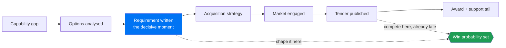

# Defence Tech: Product and Go To Market

A field guide for commercial people, product managers, and founders who are
moving a product into the defence and security market, and who have noticed
that none of the usual playbooks fit.

Commercial product management rests on a set of assumptions so ordinary that
most practitioners never say them out loud. You can talk to your users. You
can ship weekly. The person who feels the pain has a budget. A pilot leads to
a rollout. Pricing scales with seats or usage. Your roadmap is yours.

In defence, every one of those assumptions is either false or heavily
qualified. That is not because the sector is irrational or slow for the sake
of it. It is because the buyer is spending public money on equipment that
people's lives depend on, that has to work alongside equipment bought by
eleven other countries, and that will still be in service when the engineers
who built it have retired.

This guide is about what replaces those assumptions.

## Where the deal is actually decided

Commercial instinct treats the published tender as the start of the sale. In
defence it is close to the end. The influence happens upstream, while the
requirement is still being written.

By the published-tender stage you are competing on price and compliance against
a specification you did not shape. The whole guide is about getting upstream of
that blue box.

## Who this is for

- Product managers joining a defence technology company from commercial software.
- Founders of dual use companies deciding whether defence is a market or a distraction.
- Business development and sales people who need to explain to their own engineers why the deal is shaped the way it is.
- Anyone who has been handed a defence opportunity and found that their instincts keep pointing the wrong way.

It assumes no military background and no engineering background. It does
assume you have built or sold something before.

## What this is not

Not doctrine, not policy, and not legal or export control advice. Not a guide
to classified work. Nothing here is a substitute for your own counsel on
export control, security clearance, or contracting. Practice varies
considerably between countries and changes over time, so treat every
generalisation here as a starting point to verify rather than a fact to rely
on.

Everything in this guide is written from an outside, unclassified,
commercial perspective, using only publicly discussed concepts.

## Contents

| Document | What it covers |
| --- | --- |
| [01. Why defence breaks commercial product assumptions](docs/01-BROKEN-ASSUMPTIONS.md) | The seven assumptions that fail, and what replaces each |
| [02. The buyer is five people](docs/02-THE-BUYER-MAP.md) | User, requirement owner, acquirer, budget holder, certifier |
| [03. From capability gap to contract](docs/03-REQUIREMENTS-PIPELINE.md) | How a need becomes a requirement becomes a tender, and where influence actually happens |
| [04. Command and control for product people](docs/04-C2-LITERACY.md) | What C2 actually means, and why it determines your product surface |
| [05. Multi-domain operations, in practical terms](docs/05-MULTI-DOMAIN.md) | Why integration across domains changes what your product must do |
| [06. Interoperability is a requirement, not an integration](docs/06-INTEROPERABILITY.md) | Standards, federation, and the cost of being an island |
| [07. Trust and assurance as product features](docs/07-TRUST-AND-ASSURANCE.md) | Why an unexplainable system is an unusable system |
| [08. Roadmapping against programme cycles](docs/08-ROADMAPPING.md) | Planning when the buying cycle is longer than your plan |
| [09. Dual use go to market](docs/09-DUAL-USE-GTM.md) | Entering defence from a commercial base, and the traps |
| [10. Commercial models that are not seats](docs/10-COMMERCIAL-MODELS.md) | How this market actually pays for things |
| [11. Discovery when your users are unreachable](docs/11-DISCOVERY.md) | Doing real research under access constraints |
| [Glossary](docs/GLOSSARY.md) | The acronyms, in plain language |
| [Reading list](docs/READING-LIST.md) | Public sources worth your time |

## The one idea, if you read nothing else

In commercial software, you win by learning faster than your competitor.

In defence, you win by being **integrable, accountable, and still there in ten
years**. Speed still matters, and the sector says so loudly, but speed is
measured from the moment a need appears to the moment a capability is in the
hands of the people who need it. That clock includes qualification,
accreditation, training, and the logistics of support. A team that ships a
feature in a week and cannot get it accredited for two years has not been
fast. It has simply moved the delay somewhere less visible.

Every section of this guide is an elaboration of that sentence.

## Licence

MIT. See [LICENSE](LICENSE).

Written independently. Not affiliated with, endorsed by, or representing any
government, alliance, agency, or company.
