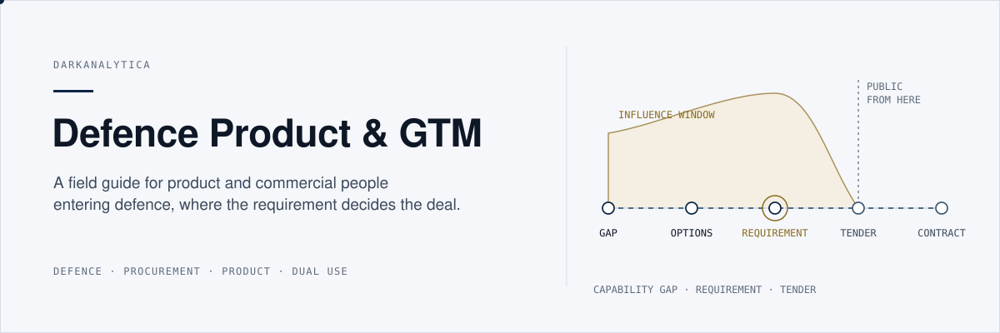
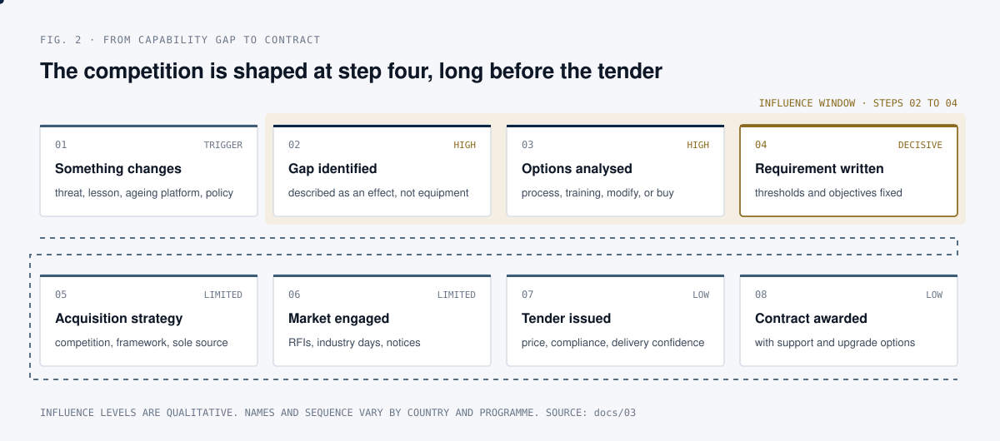
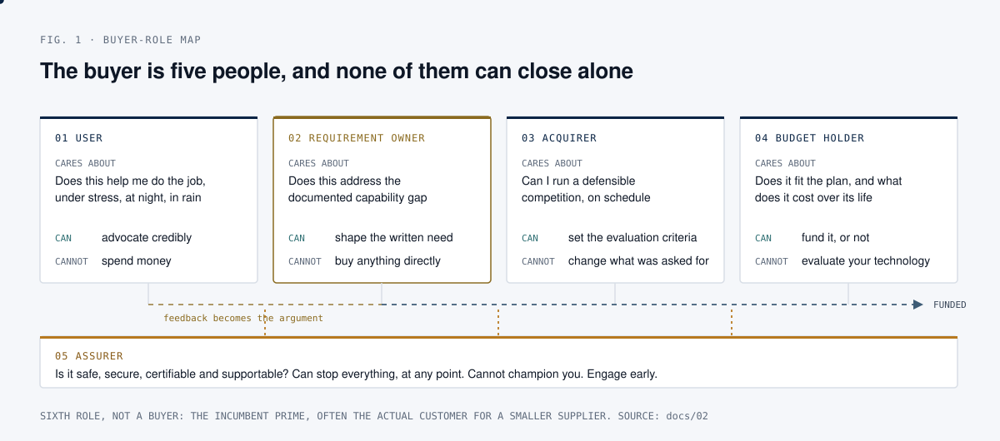

  

# Defence Tech: Product and Go To Market

## What this is

A field guide for commercial people, product managers and founders who are
moving a product into the defence and security market, and who have noticed
that none of the usual playbooks fit. It is eleven short documents, a glossary
and a reading list, written in plain language from an outside, unclassified,
commercial perspective.

Commercial product management rests on a set of assumptions so ordinary that
most practitioners never say them out loud. You can talk to your users. You
can ship weekly. The person who feels the pain has a budget. A pilot leads to
a rollout. Pricing scales with seats or usage. Your roadmap is yours. In
defence, every one of those assumptions is either false or heavily qualified.
That is not because the sector is irrational or slow for the sake of it. It is
because the buyer is spending public money on equipment that people's lives
depend on, that has to work alongside equipment bought by other nations, and
that will still be in service when the engineers who built it have retired.

This guide is about what replaces those assumptions.

## Why it matters

Most failed defence sales campaigns are not lost on technology. They are lost
because the team talked to one role in a five-role buying decision, arrived
after the requirement was written, priced by the seat against a budget fixed
years earlier, or treated accreditation as paperwork at the end. Each of those
is a predictable, avoidable error, and each has a direct consequence for what
a product team builds: explainability, graceful degradation, interoperability
with systems it has never seen, and a release architecture that separates what
can change weekly from what must stay accredited.

## Where the deal is actually decided

Commercial instinct treats the published tender as the start of the sale. In
defence it is close to the end. The influence happens upstream, while the
requirement is still being written.

  

By the published-tender stage you are competing on price and compliance
against a specification you did not shape. The whole guide is about getting
upstream of step four. See [03. From capability gap to contract](docs/03-REQUIREMENTS-PIPELINE.md).

And the decision is not taken by one person:

  

The person who wants something cannot buy it, the person who buys it did not
specify it, and the person who pays for it cannot approve it technically. See
[02. The buyer is five people](docs/02-THE-BUYER-MAP.md).

## Quick start

There is no code to install. Read in this order, depending on your time:

| If you have | Read |
| --- | --- |
| 10 minutes | [01. Why defence breaks commercial product assumptions](docs/01-BROKEN-ASSUMPTIONS.md) |
| An hour | 01, then [02. Buyer map](docs/02-THE-BUYER-MAP.md) and [03. Requirements pipeline](docs/03-REQUIREMENTS-PIPELINE.md) |
| A product decision to make | [04. C2](docs/04-C2-LITERACY.md), [06. Interoperability](docs/06-INTEROPERABILITY.md), [07. Trust and assurance](docs/07-TRUST-AND-ASSURANCE.md), [08. Roadmapping](docs/08-ROADMAPPING.md) |
| A commercial decision to make | [09. Dual use GTM](docs/09-DUAL-USE-GTM.md), [10. Commercial models](docs/10-COMMERCIAL-MODELS.md), [11. Discovery](docs/11-DISCOVERY.md) |

A test you can apply to any opportunity today, from document 02: *if everyone
I have met said yes tomorrow, what would have to happen before money moved?*
If the answer is a short chain of events you can name, the opportunity is
live. If it involves a capability plan being rewritten or an accreditation
nobody has started, it is a development project.

## Contents

| Document | What it covers |
| --- | --- |
| [01. Why defence breaks commercial product assumptions](docs/01-BROKEN-ASSUMPTIONS.md) | The seven assumptions that fail, and what replaces each |
| [02. The buyer is five people](docs/02-THE-BUYER-MAP.md) | User, requirement owner, acquirer, budget holder, assurer |
| [03. From capability gap to contract](docs/03-REQUIREMENTS-PIPELINE.md) | How a need becomes a requirement becomes a tender, and where influence actually happens |
| [04. Command and control for product people](docs/04-C2-LITERACY.md) | What C2 actually means, and why it determines your product surface |
| [05. Multi-domain operations, in practical terms](docs/05-MULTI-DOMAIN.md) | Why integration across domains changes what your product must do |
| [06. Interoperability is a requirement, not an integration](docs/06-INTEROPERABILITY.md) | Standards, federation, and the cost of being an island |
| [07. Trust and assurance as product features](docs/07-TRUST-AND-ASSURANCE.md) | Why an unexplainable system is an unusable system |
| [08. Roadmapping against programme cycles](docs/08-ROADMAPPING.md) | Planning when the buying cycle is longer than your plan |
| [09. Dual use go to market](docs/09-DUAL-USE-GTM.md) | Entering defence from a commercial base, and the traps |
| [10. Commercial models that are not seats](docs/10-COMMERCIAL-MODELS.md) | How this market actually pays for things |
| [11. Discovery when your users are unreachable](docs/11-DISCOVERY.md) | Doing real research under access constraints |
| [Glossary](docs/GLOSSARY.md) | The acronyms and terms, in plain language |
| [Reading list](docs/READING-LIST.md) | Public sources worth your time |

## Method

The guide is original synthesis written from an outside, unclassified,
commercial perspective, using only publicly discussed concepts. Each document
follows the same shape: the commercial assumption, why it fails in defence,
what replaces it, and what that means for a product or commercial team. It
assumes no military or engineering background, only that the reader has built
or sold something before.

The one idea, if you read nothing else: in commercial software you win by
learning faster than your competitor. In defence you win by being
**integrable, accountable, and still there in ten years**. Speed still
matters, but it is measured from the moment a need appears to the moment a
capability is in the hands of the people who need it. That clock includes
qualification, accreditation, training and support. A team that ships a
feature in a week and cannot get it accredited for two years has not been
fast. It has moved the delay somewhere less visible.

## Limitations and assumptions

- Not doctrine, not policy, and not legal, contracting or export control
  advice. Nothing here substitutes for your own counsel on export control,
  security clearance or contracting.
- Not a guide to classified work. Everything is at the level of publicly
  documented concepts.
- Practice varies considerably between countries and programmes, and changes
  over time. The step names and sequence in the diagrams are a generalisation;
  treat every generalisation here as a starting point to verify, not a fact to
  rely on.
- The influence levels in the pipeline diagram are qualitative judgements from
  the text, not measured data.
- The perspective is broadly European and alliance-oriented; national
  procurement rules differ in detail.

## Sources

The text is original synthesis, not assembled from a single source. For your
own reading, the [reading list](docs/READING-LIST.md) points to openly
published material, including:

- NATO Command and Control Centre of Excellence, and its open access, peer
  reviewed *Annals of Command and Control*: <https://c2coe.org/annals/>
- NATO Allied Command Transformation: <https://www.act.nato.int/>
- European Defence Agency: <https://eda.europa.eu/>
- Tenders Electronic Daily, the EU public procurement notice service: <https://ted.europa.eu/>
- NATO Support and Procurement Agency: <https://www.nspa.nato.int/>

## License

MIT. See [LICENSE](LICENSE).

Written independently. Not affiliated with, endorsed by, or representing any
government, alliance, agency, or company.
